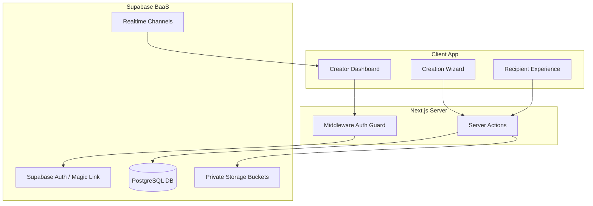
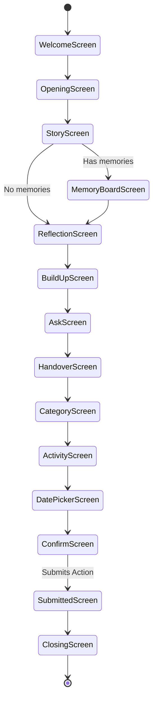

# Barua AI — Architecture & Design Document

Barua AI (meaning "Letter" in Swahili) is a personalized interactive experience web application that allows creators to build custom story-driven and emotional paths for recipients, typically culminating in a date invitation or interactive prompt. This document serves as the master guide for the system design, data architecture, security policies, and user experience flows.

---

## Table of Contents
1. [System Architecture](#1-system-architecture)
2. [Database Design & Schema](#2-database-design--schema)
3. [Authentication & Authorization](#3-authentication--authorization)
4. [Creator Flow (7-Step Wizard)](#4-creator-flow-7-step-wizard)
5. [Recipient Experience (14-Screen Journey)](#5-recipient-experience-14-screen-journey)
6. [Real-Time Mechanics & Analytics](#6-real-time-mechanics--analytics)
7. [Visual Design System & Theme System](#7-visual-design-system--theme-system)

---

## 1. System Architecture

Barua AI is built as a modern, single-database-roundtrip web app leveraging an optimized full-stack TypeScript architecture:

*   **Frontend**: Next.js 14 (App Router) using React server and client components, styled with Tailwind CSS, and animated using Framer Motion.
*   **Backend & DB**: Supabase (PostgreSQL database, Row Level Security, Edge Auth, Realtime listeners, and Storage Buckets).
*   **Emails**: Resend integration using React Email for sending Magic Links.
*   **State & Security**: Next.js Middleware verifies cookie-stored user tokens for protected routing, while Edge-enabled Server Actions are used for database transactions and analytics.



---

## 2. Database Design & Schema

The PostgreSQL database runs on Supabase, featuring customized security policies (RLS), custom triggers, and optimization indexes.

### Entity Relationship Diagram

```mermaid
erDiagram
    USERS {
        uuid id PK
        text email
        text name
        timestamptz created_at
    }
    EXPERIENCES {
        uuid id PK
        uuid user_id FK
        text slug UNIQUE
        text recipient_name
        text your_name
        text theme
        text tier
        text status
        jsonb story_beats
        text reflection
        text ask_line
        text handover_note
        jsonb memories
        jsonb date_categories
        jsonb date_options
        jsonb proposed_dates
        text closing_message
        timestamptz created_at
    }
    PHOTOS {
        uuid id PK
        uuid experience_id FK
        text storage_path
        int sort_order
        timestamptz uploaded_at
    }
    RESPONSES {
        uuid id PK
        uuid experience_id FK "UNIQUE"
        text chosen_category
        text chosen_activity
        text chosen_date
        timestamptz responded_at
    }
    EVENTS {
        uuid id PK
        uuid experience_id FK
        text type
        jsonb meta
        timestamptz occurred_at
    }

    USERS ||--o{ EXPERIENCES : "creates"
    EXPERIENCES ||--o{ PHOTOS : "includes"
    EXPERIENCES ||--o| RESPONSES : "receives"
    EXPERIENCES ||--o{ EVENTS : "emits"
```

### Table Definitions

#### `public.users`
Synchronized with Supabase's internal auth engine.
*   `id` (`uuid`, Primary Key): References `auth.users(id)` with cascading deletes.
*   `email` (`text`, Not Null): User's primary login email.
*   `name` (`text`): User's profile name.
*   `created_at` (`timestamptz`): Default current timestamp.

#### `public.experiences`
Stores the customized interactive letter config.
*   `id` (`uuid`, Primary Key): Defaults to a random UUID.
*   `user_id` (`uuid`): References `public.users(id)` on delete cascade.
*   `slug` (`text`, Unique): Path URL segment for recipient access (e.g. `barua.app/for/love-letter-1`).
*   `recipient_name` (`text`): Name of the recipient.
*   `your_name` (`text`): Name of the sender.
*   `theme` (`text`): Enum constraint `('romantic', 'playful', 'cinematic')`.
*   `tier` (`text`): Enum constraint `('free', 'premium')`.
*   `status` (`text`): Enum constraint `('draft', 'active', 'responded')`.
*   `story_beats` (`jsonb`): Array of emotional progressive statements.
*   `reflection` (`text`): Extended message reflection.
*   `ask_line` (`text`): The core prompt/question.
*   `handover_note` (`text`): Transition note before user answers.
*   `memories` (`jsonb`): List of memory objects `{ title: string, photo_path?: string }`.
*   `date_categories` (`jsonb`): Categories allowed (e.g., `['food', 'outdoor']`).
*   `date_options` (`jsonb`): List of possible activities `{ category: string, activities: string[] }`.
*   `proposed_dates` (`jsonb`): Array of user-defined date options.
*   `closing_message` (`text`): Success state closing letter.

#### `public.photos`
Media references linked to experiences.
*   `id` (`uuid`, Primary Key): Random UUID.
*   `experience_id` (`uuid`): References `public.experiences(id)` on delete cascade.
*   `storage_path` (`text`): Location key inside Supabase Storage bucket.
*   `sort_order` (`int`): Display order weight.

#### `public.responses`
Filled by the recipient upon confirming selection options.
*   `id` (`uuid`, Primary Key): Random UUID.
*   `experience_id` (`uuid`, Unique): References `public.experiences(id)` on delete cascade.
*   `chosen_category` (`text`): selected theme/category.
*   `chosen_activity` (`text`): selected activity line.
*   `chosen_date` (`text`): selected date option.
*   `responded_at` (`timestamptz`): Timestamp of submission.

#### `public.events`
Analytics logging (page views, shares).
*   `id` (`uuid`, Primary Key).
*   `experience_id` (`uuid`): References `public.experiences(id)`.
*   `type` (`text`): Check constraint `('opened', 'responded', 'shared')`.
*   `meta` (`jsonb`): Additional payload data (IP approximations, browser details, etc.).

---

## 3. Authentication & Authorization

Barua AI implements strict authorization policies on all data tables.

*   **Login Flow**: Handled via Magic Link (One-Time Password) sent to user inbox. The app redirects callback payloads via `/auth/callback` to establish local session cookies.
*   **Middleware Guard (`middleware.ts`)**:
    *   Secures all routes starting with `/dashboard` or `/create`.
    *   Unauthenticated attempts redirect to `/login?redirect=...`.
    *   Recipient screens (`/for/[slug]`) remain public.
*   **Row Level Security (RLS) Policies**:
    *   `users`: Read and update policies restricted to `auth.uid() = id`.
    *   `experiences`: Creators can fully manage their own documents (`auth.uid() = user_id`). Anyone can read active experiences by slug without login (`status = 'active'`).
    *   `responses`: Creators can read responses for their experiences. Public users can insert response payloads but are blocked from updates or select actions.
    *   `events`: Anyone can insert tracking actions; only creators can read them.

---

## 4. Creator Flow (7-Step Wizard)

The creator builds experiences step-by-step through a 7-step wizard (`src/components/creator/`):

1.  **Basics (`BasicsStep.tsx`)**: Form fields specifying the recipient's name, the creator's name, and creating a unique page slug.
2.  **Theme (`ThemeStep.tsx`)**: Style toggle to select from Romantic, Playful, or Cinematic presets.
3.  **Story (`StoryStep.tsx`)**: Input fields to add up to 5 progressive story beats that build emotional tension.
4.  **Memories (`MemoriesStep.tsx`)**: File uploader to import memory photos alongside descriptive captions, uploaded securely to Supabase's private `experience-photos` storage bucket.
5.  **Ask Line (`AskStep.tsx`)**: Input of the peak question prompt (e.g. "Will you go out with me?").
6.  **Proposed Dates (`DatesStep.tsx`)**: Checkbox configuration defining category filters, custom activities, and multiple target dates for the recipient to select from.
7.  **Closing Step (`ClosingStep.tsx`)**: Creation of the final sweet note shown at the end of the journey, followed by a **Seal & Send** activation trigger.

---

## 5. Recipient Experience (14-Screen Journey)

The recipient navigates a 14-screen interactive path (`src/components/recipient/screens/`):

| Index | Screen Component | Purpose / Behavior |
|---|---|---|
| **0** | `WelcomeScreen` | Introduction slide showing "A letter from [Sender]". |
| **1** | `OpeningScreen` | Warm introduction line transitioning into the emotional beats. |
| **2** | `StoryScreen` | Displays the progressive story beats with subtle transition delays. |
| **3** | `MemoryBoardScreen` | Media grid showing memory titles and photos (automatically skipped if no media was configured by the creator). |
| **4** | `ReflectionScreen` | Deep emotional note rendered in an intimate handwritten aesthetic style. |
| **5** | `BuildUpScreen` | A short, high-tension statement directly leading to the invite hook. |
| **6** | `AskScreen` | The emotional peak: "Would you love to go on a date?" with custom action triggers. |
| **7** | `HandoverScreen` | Transition screen instructing the recipient to plan the date options. |
| **8** | `CategoryScreen` | Filter selection (e.g., Food & Drinks, Outdoors, Indoors). |
| **9** | `ActivityScreen` | Displays the customized activities mapped to their chosen category. |
| **10**| `DatePickerScreen` | A customized grid of the specific dates proposed by the creator. |
| **11**| `ConfirmScreen` | Summary view of selections with a **Confirm & Send** server action execution. |
| **12**| `SubmittedScreen` | Animated success checkmark indicating the response has been sent. |
| **13**| `ClosingScreen` | Displays the creator's closing message as the final card in the stack. |



---

## 6. Real-Time Mechanics & Analytics

*   **Analytics Capture**: The instant the recipient lands on `/for/[slug]`, a server action calls `logEventAction(id, 'opened')`, updating the analytics log.
*   **Dashboard Listening (`ResponseWatcher.tsx`)**:
    *   The creator dashboard detail view hooks into Supabase's Realtime Engine.
    *   It creates a Postgres change subscription filtered specifically on `responses` inserts for the experience ID.
    *   When the recipient submits their choice, a notification pops up instantly on the creator's dashboard, shifting state from "Awaiting Response" to "Celebration Card" without requiring a manual page refresh.

---

## 7. Visual Design System & Theme System

Themes are defined as functional CSS class dictionaries in `src/lib/recipient/themes.ts`:

```typescript
export interface ThemeConfig {
  bg: string;
  text: string;
  accent: string;
  accentBg: string;
  border: string;
  cardBg: string;
  font: string;
  buttonBg: string;
  buttonDisabled: string;
}
```

### Supported Styles

*   **Romantic**:
    *   *Palette*: Delicate Rose (`bg-rose-50/60`), deep rose text (`text-rose-950`), custom pink accents (`#D4537E`).
    *   *Typography*: Serif fonts for a classic literary look.
*   **Playful**:
    *   *Palette*: Soft Warm Cream (`bg-[#FFFDF5]`), dark brown amber (`text-amber-950`), vivid orange buttons (`bg-orange-500`).
    *   *Typography*: Clean Sans-Serif font.
*   **Cinematic**:
    *   *Palette*: Deep Space Gray/Black (`bg-gray-950`), high-contrast golden highlights (`text-amber-400`), stark white action buttons.
    *   *Typography*: High-tech monospace.
